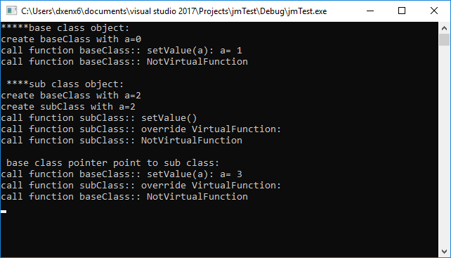

# 重载(Overload)，重写(覆盖Override)，隐藏
## 总结
+ 重载(Overload)针对同一作用域下的同名函数；
+ 覆盖(Override)和隐藏针对继承类之间的函数关系：
  + 覆盖(Override)针对**virtual函数** ，子类重新定义了相同函数名和相同参数列表的函数。
  + 隐藏的函数，子类函数对父类隐藏，父类函数对子类隐藏！！！
     + 隐藏发生在：
        + 子类定义了在父类中的同名函数且参数列表不同
        + 参数列表相同但父类函数不是virtual函数。"

### 重写和隐藏的代码解读

```c++
class baseClass
{
public:
    baseClass(int a)
    {
        m_a = a;
        cout << "create baseClass with a=" << m_a << endl;
    }

    //被隐藏的基类函数1，基类不可调用，只有父类对象或父类指针可以调用
    //"setValue" with ONE parameter，因为基类定义了同名不同参的函数
    void setValue(int newV)
    {
        m_a = newV;
        cout << "call function baseClass:: setValue(a): a= " << m_a << endl;
    }
    
    //被隐藏的基类函数2，因为子类定义了同名同参的函数
    void NotVirtualFunction()
    {
        cout << "call function baseClass:: NotVirtualFunction" << endl;
    }

    virtual void VirtualFunction() {};

protected:
    int m_a;
};

class subClass :public baseClass
{
public:
    subClass(int a) :baseClass(a)
    {
        cout << "create subClass with a=" << m_a << endl;
    }

    void setValue()  //"setValue" with NO parameter 这个函数导致父类同名函数被隐藏，因为参数不同
    {
        cout << "call function subClass:: setValue()" << endl;
    }

    void NotVirtualFunction()//这个函数也会导致父类同名函数被隐藏，因为父类函数不是虚函数
    {
        cout << "call function subClass:: NotVirtualFunction" << endl;
    }

    void VirtualFunction()//重写的函数  override
    {
        cout << "call function subClass:: override VirtualFunction:"  << endl;
    }
};

int main()
{
    cout << "*****base class object: \n";
    baseClass baseObject(0);
    baseObject.setValue(1);
    baseObject.VirtualFunction();
    baseObject.NotVirtualFunction();

    cout << "\n ****sub class object: \n";
    subClass subObject(2);
    subObject.setValue();//子类对象只能调用子类的setValue函数
    //subObject.setValue(22);  //build error: 'subClass::setValue': function does not take 1 arguments
    subObject.VirtualFunction();
    subObject.NotVirtualFunction();

    cout << "\n base class pointer point to sub class: \n";
    baseClass* p = &subObject; //基类指针，指向子类对象
    //p->setValue(); //build error C2660: 'baseClass::setValue': function does not take 0 arguments
    p->setValue(3);//父类指针，尽管指向子类对象，也只能调用父类的setValue函数，一个参数
    p->VirtualFunction(); 
    p->NotVirtualFunction(); //ATTENTION!!! call function baseClass::NotVirtualFunction

    int intV;
    std::cin >> intV;
    return 0;
}
```
 
